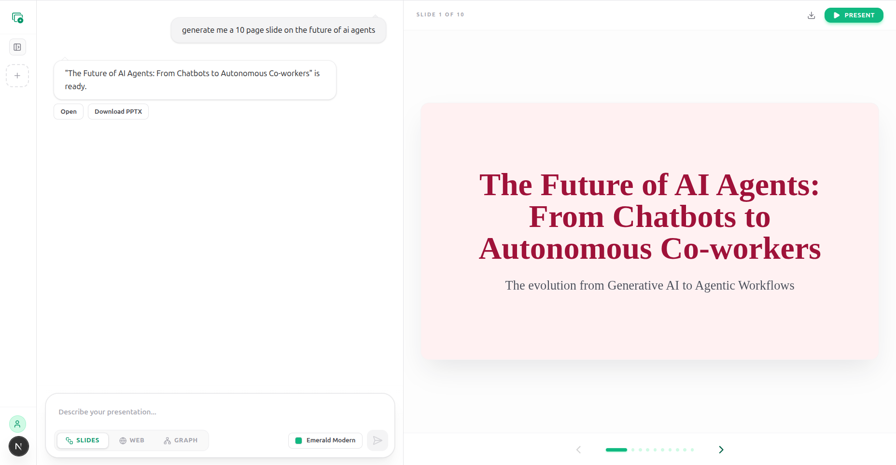
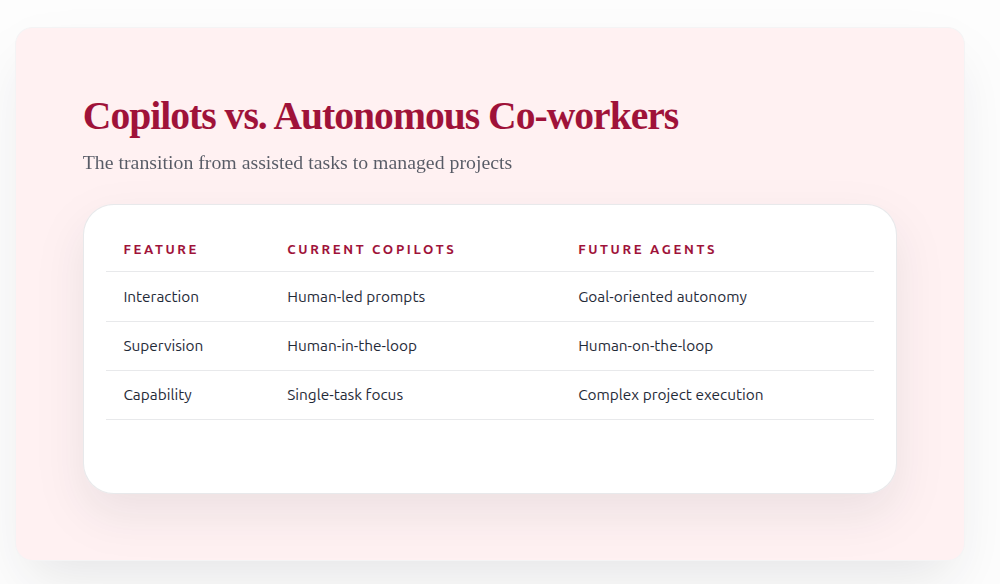
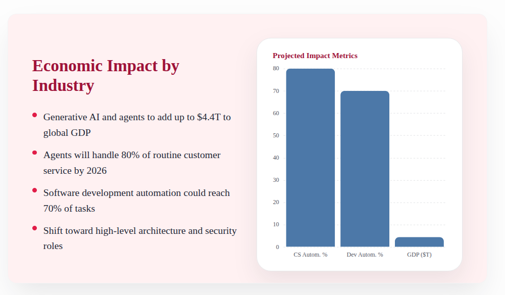
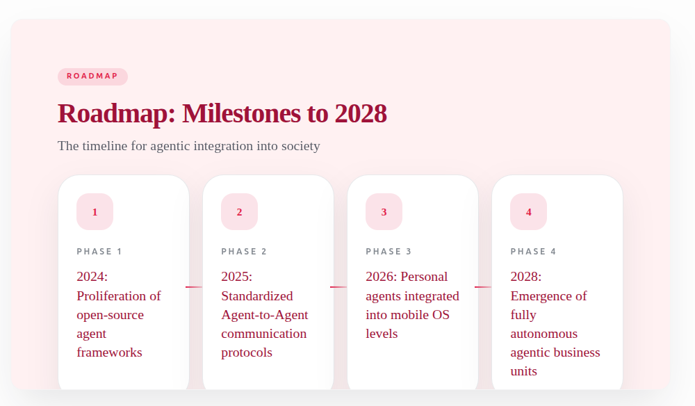
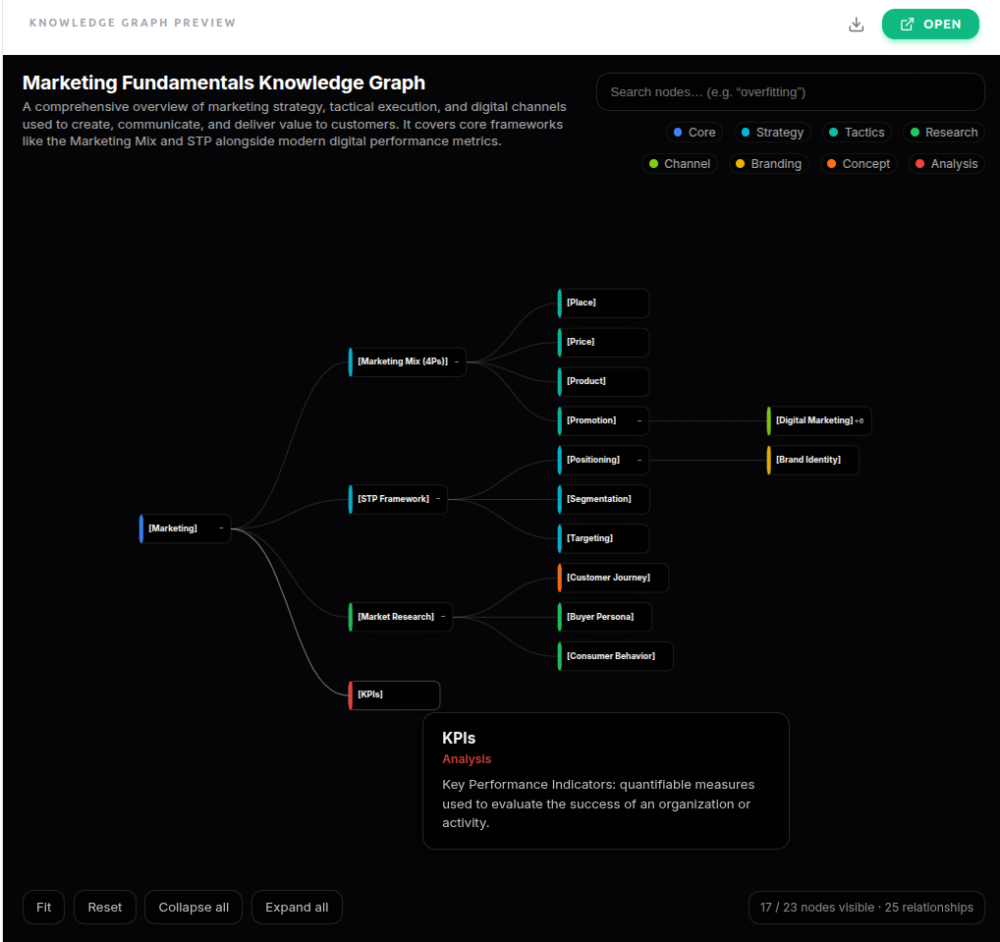

<p align="left">
  
</p>

AgentSlide is a Next.js app that generates presentation outputs from a text prompt using a streamed, multi-step AI pipeline.

It currently supports three creation modes:
- Slides: structured deck output with PPTX export and web presentation view
- Webpage: single-page HTML output
- Knowledge Graph: interactive graph HTML output

## Features

- Chat-based studio at `/studio`
- Real-time SSE pipeline progress
- Three generation modes with mode-specific pipeline tracking
- PPTX export for slide mode
- History browser with reload/delete
- Local file-based output persistence (`output/<uuid>`)

## Quick Start

### 1. Install

```bash
npm install
cp .env.example .env.local
```

### 2. Configure

Set at least:

```env
GOOGLE_GENAI_API_KEY=your_api_key_here
```

Get API key: https://aistudio.google.com/apikey

### 3. Run

```bash
npm run dev
```

Open:
- Landing page: `http://localhost:3000/`
- Studio: `http://localhost:3000/studio`

## Mode Pipelines

### Slides mode

Pipeline steps:
1. `intake`
2. `planning`
3. `research`
4. `generation`
5. `assets`
6. `qa`
7. `rendering`

Notes:
- `assets` includes deterministic chart/table processing and image URL resolution.
- PPTX rendering runs when output is not web-only.

### Webpage mode

Pipeline steps:
1. `research`
2. `generation`

Output: `index.html` served by `/api/output-html?id=<pageId>`.

### Knowledge Graph mode

Pipeline steps:
1. `research`
2. `generation`
3. `rendering`

Output: `index.html` + `graph-data.json`.

## API Routes

### Generation

- `POST /api/generate` (slides, SSE)
  - Body: `{ prompt, theme?, approvedPlan? }`
- `POST /api/generate-webpage` (webpage, SSE)
  - Body: `{ prompt }`
- `POST /api/generate-knowledge-graph` (knowledge graph, SSE)
  - Body: `{ prompt, depth? }`

SSE events used by frontend:
- `progress`
- `complete`
- `error`
- `log` (slides route tracing)

### Retrieval and exports

- `GET /api/deck/[id]` - validated `deck.json`
- `GET /api/export?id=<deckId>` - PPTX download
- `GET /api/output-html?id=<id>` - HTML output view
- `GET /api/assets/[deckId]/[file]` - image asset serving

### History

- `GET /api/history` - list saved outputs
- `GET /api/history/[id]` - load one saved output
- `DELETE /api/history/[id]` - delete saved output directory

## Output Storage

Each run is saved under `output/<uuid>/`.

Typical slide run:
- `deck.json`
- `meta.json`
- `trace.jsonl`
- `presentation.pptx` (when generated)
- `assets/*` (image files/refs as applicable)

Typical webpage run:
- `index.html`
- `meta.json`

Typical knowledge graph run:
- `index.html`
- `graph-data.json`
- `meta.json`

## Environment Variables

See `.env.example` for full list. Most commonly used:

### Required

- `GOOGLE_GENAI_API_KEY`

### AI config

- `GEMINI_MODEL`
- `GEMINI_TEMPERATURE_INTAKE`
- `GEMINI_TEMPERATURE_PLANNING`
- `GEMINI_TEMPERATURE_CONTENT`
- `GEMINI_TEMPERATURE_RESEARCH`
- `GEMINI_TEMPERATURE_COMPRESSION`
- `GEMINI_MAX_RETRIES`

### Image pipeline

- `SLIDEMAKER_IMAGE_PROVIDER` (current effective provider: unsplash)
- `UNSPLASH_ACCESS_KEY` (optional; seeded picsum fallback when missing)
- `SLIDEMAKER_IMAGE_STRICT`

### Generation and debug

- `SLIDE_GENERATION_BATCH_SIZE`
- `NEXT_PUBLIC_DEBUG_MODE`

## Development

### Commands

```bash
npm run dev
npm run build
npm run start
npm run typecheck
```

### Current structure

```text
app/
  api/
    assets/[deckId]/[file]/route.ts
    deck/[id]/route.ts
    export/route.ts
    generate/route.ts
    generate-webpage/route.ts
    generate-knowledge-graph/route.ts
    history/route.ts
    history/[id]/route.ts
    output-html/route.ts
  presentation/[id]/page.tsx
  studio/page.tsx
lib/
  agents/
  renderers/
  hooks/
  schemas.ts
  types.ts
components/
  chat-interface.tsx
  preview-panel.tsx
  sidebar.tsx
output/
```

## Tech Stack

- Next.js 15 (App Router)
- React 19 + TypeScript
- Google Gemini via `@google/genai`
- Zod validation
- PptxGenJS
- Vega / Vega-Lite
- Framer Motion

## License

MIT

## Screenshots

### Slides






### Knowledge Graph


