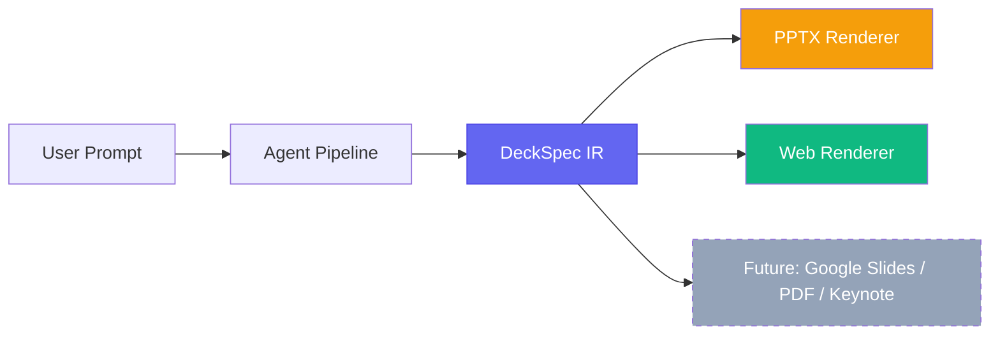
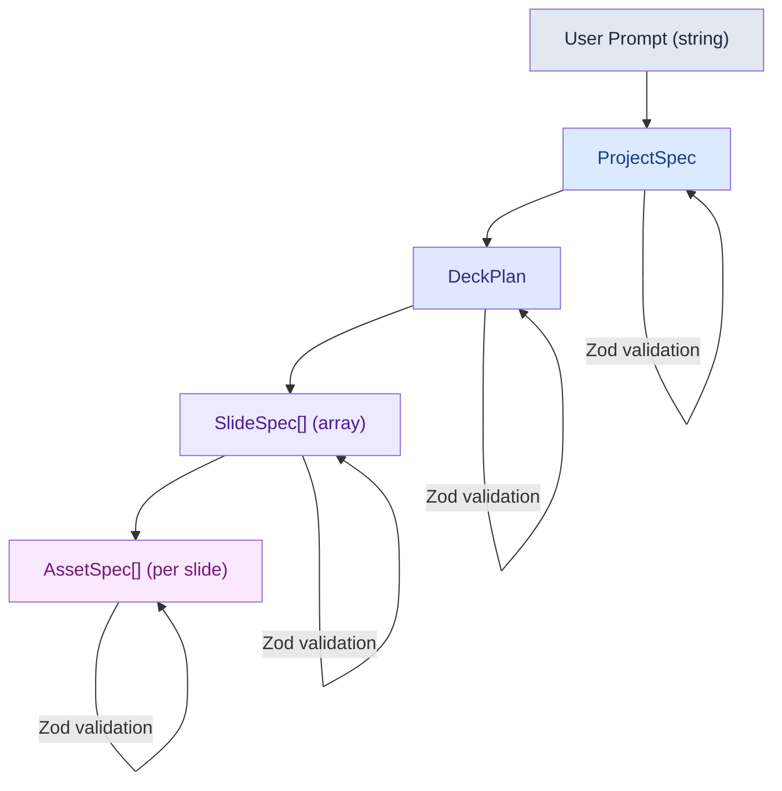
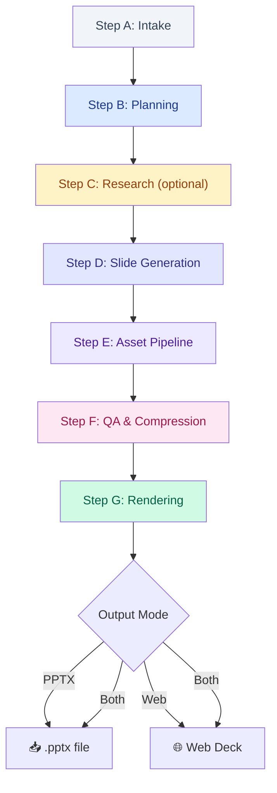
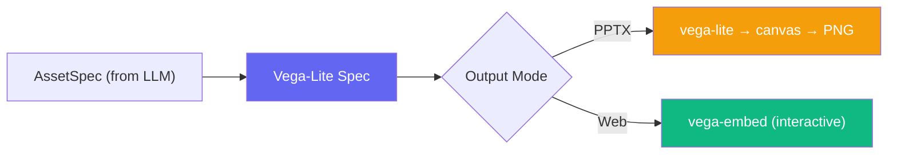

# 🎯 SlideMaker — AI Presentation Agent Architecture

> An AI agent that takes a text prompt and produces a complete presentation — either as a downloadable `.pptx` file, an interactive web deck, or both.

---

## Table of Contents

- [Core Design Principle](#core-design-principle)
- [Technology Stack](#technology-stack)
- [Data Models (Intermediate Representation)](#data-models-intermediate-representation)
- [Agent Workflow (Multi-Step DAG)](#agent-workflow-multi-step-dag)
- [Rendering Adapters](#rendering-adapters)
- [Chart & Visual Strategy](#chart--visual-strategy)
- [Project Structure](#project-structure)
- [Security Considerations](#security-considerations)
- [MVP Scope & Build Order](#mvp-scope--build-order)

---

## Core Design Principle

**Separate "DeckSpec" (what to build) from "Renderers" (how to build it).**

The agent produces a **structured Intermediate Representation (IR)** — a validated JSON spec describing every slide, its content, and its visuals. Then pluggable renderers consume that IR:



**Why this matters:**
- LLM is prompted **once** — not re-prompted per output format
- Adding new renderers requires zero changes to the agent logic
- Testing is clean — validate the IR, renderers are deterministic
- Results stay consistent across output modes

---

## Technology Stack

### Language: TypeScript (Next.js)

| Factor | Rationale |
|---|---|
| **AI Integration** | `@google/genai` SDK has first-class TypeScript support |
| **Two output modes** | PPTX generation + web presentation both live naturally in a Next.js app |
| **Charts** | Vega-Lite (declarative JSON → render to PNG or interactive) |
| **PPTX Export** | `pptxgenjs` — works in Node, supports slide masters, charts, images |
| **UI Framework** | Shadcn UI + Tailwind for the builder interface |
| **Validation** | Zod schemas at every agent step + `zod-to-json-schema` for Gemini Structured Outputs |
| **Animations** | Framer Motion for web slide transitions |

### Key Dependencies

| Package | Purpose |
|---|---|
| `next` | App framework (App Router) |
| `@google/genai` | Gemini 2.5 Flash / Gemini 3 Flash API |
| `zod` | Schema validation for all AI outputs |
| `zod-to-json-schema` | Convert Zod → JSON Schema for Gemini Structured Outputs |
| `pptxgenjs` | PowerPoint file generation |
| `vega-lite` + `vega` | Declarative chart specs → PNG/SVG/interactive |
| `framer-motion` | Web slide transitions & micro-animations |
| `shadcn/ui` | UI components for the builder app |

### Infrastructure (MVP)

| Concern | MVP Choice | Future Scale |
|---|---|---|
| **Job state** | In-memory / SQLite | Redis |
| **File storage** | Local filesystem | S3 / GCS |
| **Deployment** | Local dev / self-hosted | Docker + reverse proxy |

---

## Data Models (Intermediate Representation)

Every agent step produces validated JSON via **Gemini Structured Outputs** with **Zod schemas**. This gives hard failures early instead of silent garbage downstream.

### 1. `ProjectSpec` — User Intent + Constraints

Parsed from the raw user prompt. Missing fields get sensible defaults.

```typescript
const ProjectSpecSchema = z.object({
  topic: z.string(),                              // "History of Bangladesh"
  audience: z.enum([
    "high_school", "university", 
    "investors", "general"
  ]).default("general"),
  durationMinutes: z.number().optional(),          // estimated presentation time
  style: z.enum([
    "academic", "minimal", "modern", 
    "corporate", "vibrant"
  ]).default("modern"),
  output: z.enum(["pptx", "web", "both"]).default("both"),
  language: z.enum(["en", "bn"]).default("en"),
  citationStyle: z.enum([
    "footnote", "speaker_notes", "end_slide", "none"
  ]).default("speaker_notes"),
  slideCountPreference: z.number().optional(),     // user override
});
```

### 2. `DeckPlan` — Planning Result

High-level outline. No content yet — just structure and intent.

```typescript
const DeckPlanSchema = z.object({
  title: z.string(),
  slideCount: z.number().min(3).max(30),
  slides: z.array(z.object({
    slideNumber: z.number(),
    purpose: z.string(),                           // "Title", "Colonial Period", "Summary"
    visualIntent: z.enum([
      "none", "timeline", "map", "bar_chart",
      "line_chart", "pie_chart", "photo_grid",
      "quote", "comparison_table", "infographic",
      "big_number"
    ]),
    layoutHint: z.enum([
      "title_slide", "bullets", "two_column",
      "chart_with_text", "full_visual", "big_number"
    ]),
  })),
  suggestedTheme: z.string(),
});
```

### 3. `SlideSpec` — Render-Ready Content

Per-slide content with hard limits enforced by the schema.

```typescript
const SlideSpecSchema = z.object({
  slideNumber: z.number(),
  title: z.string().max(80),
  subtitle: z.string().max(120).optional(),
  bullets: z.array(
    z.string().max(100)                            // hard limit: 100 chars per bullet
  ).max(6),                                        // hard limit: 6 bullets max
  speakerNotes: z.string().max(500).optional(),
  layout: z.enum([
    "title_slide", "bullets", "two_column",
    "chart_with_text", "full_visual", "big_number"
  ]),
  visuals: z.array(AssetSpecSchema).max(3),
  citations: z.array(z.object({
    text: z.string(),
    url: z.string().url().optional(),
    placement: z.enum(["footnote", "speaker_notes", "end_slide"]),
  })).optional(),
});
```

### 4. `AssetSpec` — Visual Asset Definitions

Tells the renderer **what** to show. Deterministic code decides **how**.

```typescript
const AssetSpecSchema = z.discriminatedUnion("type", [
  // Chart asset
  z.object({
    type: z.literal("chart"),
    chartType: z.enum(["bar", "line", "pie", "timeline", "area"]),
    title: z.string(),
    data: z.object({
      labels: z.array(z.string()),
      datasets: z.array(z.object({
        label: z.string(),
        values: z.array(z.number()),
      })),
    }),
    vegaLiteSpec: z.record(z.any()).optional(),     // full Vega-Lite override
  }),
  // Image asset
  z.object({
    type: z.literal("image"),
    query: z.string(),                             // search query or description
    url: z.string().url().optional(),               // direct URL if known
    alt: z.string(),
    cropMode: z.enum(["fill", "fit", "contain"]).default("fill"),
  }),
  // Table asset
  z.object({
    type: z.literal("table"),
    headers: z.array(z.string()),
    rows: z.array(z.array(z.string())),
  }),
  // Big number / statistic
  z.object({
    type: z.literal("big_number"),
    value: z.string(),                             // "170M+" or "52 years"
    label: z.string(),
    context: z.string().optional(),
  }),
]);
```

### Data Flow Diagram



---

## Agent Workflow (Multi-Step DAG)

A state machine where each step produces **validated output** before the next step begins. Every Gemini call uses **Structured Outputs** (JSON Schema) so results are deterministic and parseable.



### Step A — Intake → `ProjectSpec`

- Parse the raw user prompt with Gemini
- Extract constraints: slide count, tone, audience, output format, language
- **If missing, assume sensible defaults** — never block the user with questions

### Step B — Planning → `DeckPlan`

- Use Gemini Structured Outputs so planning is deterministic and parseable
- Model outputs the slide outline with `purpose` and `visualIntent` per slide
- User can optionally review/edit the plan before proceeding
- Validate with Zod schema — hard fail if invalid

### Step C — Research & Citation Grounding *(optional, topic-dependent)*

For factual topics (history, science, economics) where accuracy matters:

| Approach | Description | When to Use |
|---|---|---|
| **Gemini's built-in knowledge** | Rely on model's training data | MVP / general topics |
| **Gemini tool calls** | Google Search + URL Context via Gemini's built-in tools | When available in deployment |
| **App-side search** | Your app does web search → passes snippets to model | Full control, more work |

**MVP recommendation**: Use Gemini's built-in knowledge + `sources: string[]` in SlideSpec for self-reported citations. Add Google Search grounding in v2.

### Step D — Slide-by-Slide Generation → `SlideSpec[]`

- Generate each slide spec **independently**, potentially in parallel
- Use the slide's `purpose` from DeckPlan + any research notes as context
- **Hard limits enforced by schema**:
  - Max 6 bullets per slide
  - Max 100 characters per bullet
  - Max 3 visuals per slide
  - Max 500 characters for speaker notes
- This prevents the classic LLM failure: paragraph-stuffed slides

### Step E — Asset Pipeline *(deterministic visuals)*

> **Rule: LLM decides *what* to visualize. Deterministic code decides *how* it looks.**

This is where most AI presentation tools break. Our approach:

1. LLM outputs an `AssetSpec` describing the data and chart type
2. Code converts `AssetSpec` → **Vega-Lite JSON spec** (if not already provided)
3. Renderer produces the final visual:
   - **PPTX mode**: Vega-Lite → PNG/SVG → embed as image in slide
   - **Web mode**: Vega-Lite → interactive Vega embed in browser

### Step F — QA & Compression Pass

**Non-optional** validation before rendering:

| Check | Action |
|---|---|
| Schema validation | Hard fail if any SlideSpec is invalid |
| Bullet overflow | If `bullets.length > 5` or any bullet > 80 chars → run compression pass |
| Visual count | Ensure no slide exceeds layout capacity |
| Missing citations | Flag if research mode was used but citations are empty |
| Content compression | Quick Gemini call to tighten overcrowded slides |

### Step G — Rendering

Pass the validated `SlideSpec[]` to the appropriate renderer(s). See [Rendering Adapters](#rendering-adapters).

### Streaming Progress to Frontend

Use **Server-Sent Events (SSE)** to stream real-time progress:

```
Step A: Parsing your prompt...        ✅
Step B: Planning 10 slides...         ✅
Step C: Researching key dates...      ✅
Step D: Generating slide 3/10...      🔄
Step D: Generating slide 4/10...      ⏳
Step E: Rendering charts...           ⏳
Step F: Quality check...              ⏳
Step G: Building PPTX...              ⏳
```

---

## Rendering Adapters

Both renderers consume the **same `SlideSpec[]`** — no re-prompting the LLM.

### PPTX Renderer (`pptxgenjs`)

| Aspect | Detail |
|---|---|
| **Library** | `pptxgenjs` — works in Node, supports slide masters, shapes, images, tables |
| **Templates** | Small set of reusable layouts: `title_slide`, `bullets`, `two_column`, `chart_with_text`, `full_visual`, `big_number` |
| **Charts** | Vega-Lite → render to PNG server-side → embed as image |
| **Tables** | Native PPTX table objects |
| **Images** | Download/generate → embed as base64 or buffer |
| **Approach** | Map `SlideSpec.layout` → template → place objects via grid rules |

### Web Renderer (Custom React)

| Aspect | Detail |
|---|---|
| **Framework** | Custom React `<Slide>` components (not Reveal.js — avoids framework conflicts with Next.js) |
| **Transitions** | Framer Motion for slide transitions + micro-animations |
| **Navigation** | Keyboard (←→), swipe, click, progress bar |
| **Charts** | Vega-Lite → interactive Vega embed (hover, tooltips) |
| **Themes** | CSS variables per theme — switch without re-render |
| **Export** | Browser print → PDF as a bonus |
| **Fullscreen** | Fullscreen API for presentation mode |

### Output Mode Comparison

| Feature | PPTX | Web Deck |
|---|---|---|
| Charts | Static PNG/SVG | Interactive (hover, zoom) |
| Transitions | PowerPoint native | CSS/Framer Motion |
| Sharing | Email / upload .pptx | Share a URL |
| Editing | Open in PowerPoint / Google Slides | In-app editing (future) |
| Infographics | Limited by PPTX | Full HTML/CSS/SVG |
| Offline | ✅ Yes | Needs hosting |
| Complexity | Medium | Higher |

---

## Chart & Visual Strategy

### Why Vega-Lite?

| Criterion | Vega-Lite | ECharts | Recharts |
|---|---|---|---|
| **LLM compatibility** | ✅ Declarative JSON — model outputs a spec | ⚠️ Imperative API — harder for LLM | ⚠️ React components — not a JSON spec |
| **Dual rendering** | ✅ PNG (PPTX) + interactive (web) | ✅ Canvas + SVG | ❌ React-only |
| **IR fit** | ✅ Spec IS the IR | ❌ Spec is code | ❌ Spec is JSX |
| **Ecosystem** | Vega ecosystem, Observable | Apache, huge community | React ecosystem |

**Decision**: Vega-Lite for the IR. The LLM can output a Vega-Lite spec directly (or we construct one from the simpler `AssetSpec.data` field).

### Chart Pipeline



---

## Project Structure

```
slidemaker/
├── app/                              # Next.js App Router
│   ├── page.tsx                      # Landing page — prompt input
│   ├── create/
│   │   └── page.tsx                  # Creation wizard (agent progress UI)
│   ├── presentation/
│   │   └── [id]/
│   │       └── page.tsx              # Web presentation viewer (fullscreen)
│   ├── api/
│   │   ├── generate/
│   │   │   └── route.ts              # Main generation endpoint (SSE streaming)
│   │   └── export/
│   │       └── route.ts              # PPTX download endpoint
│   └── layout.tsx
│
├── lib/
│   ├── agents/                       # 🧠 Agent Pipeline
│   │   ├── orchestrator.ts           # DAG runner — executes steps A→G
│   │   ├── intake.ts                 # Step A: prompt → ProjectSpec
│   │   ├── planner.ts                # Step B: ProjectSpec → DeckPlan
│   │   ├── researcher.ts             # Step C: DeckPlan → research notes
│   │   ├── slide-generator.ts        # Step D: DeckPlan → SlideSpec[]
│   │   ├── asset-pipeline.ts         # Step E: SlideSpec[] → resolved assets
│   │   ├── qa.ts                     # Step F: validation + compression
│   │   └── prompts/                  # System prompts per agent step
│   │       ├── intake.ts
│   │       ├── planner.ts
│   │       ├── content.ts
│   │       └── compressor.ts
│   │
│   ├── renderers/                    # 🔧 Output Renderers
│   │   ├── pptx-renderer.ts          # SlideSpec[] → .pptx (PptxGenJS)
│   │   ├── web-renderer.ts           # SlideSpec[] → React-ready data
│   │   └── chart-renderer.ts         # AssetSpec → Vega-Lite → PNG/SVG/embed
│   │
│   ├── gemini.ts                     # Gemini client + structured output helper
│   ├── schemas.ts                    # All Zod schemas (IR definitions)
│   └── types.ts                      # Inferred TypeScript types from schemas
│
├── components/
│   ├── ui/                           # Shadcn UI components
│   ├── prompt-input.tsx              # Main prompt textarea + suggestions
│   ├── generation-progress.tsx       # Real-time SSE progress viewer
│   ├── plan-preview.tsx              # DeckPlan preview + edit before generation
│   ├── output-selector.tsx           # PPTX / Web / Both toggle
│   ├── theme-selector.tsx            # Presentation theme picker
│   └── presentation/                 # Web Deck Components
│       ├── slide-renderer.tsx        # Routes SlideSpec → correct slide component
│       ├── slides/
│       │   ├── title-slide.tsx
│       │   ├── bullet-slide.tsx
│       │   ├── two-column-slide.tsx
│       │   ├── chart-slide.tsx
│       │   ├── full-visual-slide.tsx
│       │   └── big-number-slide.tsx
│       ├── charts/
│       │   └── vega-chart.tsx        # Vega-Lite embed wrapper
│       └── presentation-controls.tsx # Nav, fullscreen, progress bar
│
├── styles/
│   └── themes/                       # Presentation themes (CSS variables)
│       ├── modern-dark.css
│       ├── minimal-light.css
│       ├── corporate.css
│       └── vibrant.css
│
├── docs/
│   └── architecture.md               # This file
│
└── public/
    └── templates/                    # PPTX template master slides
```

---

## Security Considerations

- **API keys server-side only** — all Gemini calls happen in API routes / server actions, never in client-side code
- **Input sanitization** — user prompts are passed through the intake agent, never directly interpolated into system prompts
- **Rate limiting** — add per-user rate limits on the `/api/generate` endpoint
- **File size limits** — cap generated PPTX size and number of slides
- **Output validation** — generated PPTX and web content are validated before serving

---

## AI Reliability & Retries

LLMs are non-deterministic. Occasionally they'll produce broken JSON or miss a constraint despite Zod schemas. The agent pipeline must handle this gracefully.

| Strategy | Detail |
|---|---|
| **Automatic retries** | If a step fails Zod validation, feed the error back to the LLM and retry (up to 3 attempts) before failing the request |
| **Error feedback** | Include the Zod error message in the retry prompt so the model can self-correct |
| **Graceful degradation** | If a non-critical step fails (e.g., research), continue with reduced quality rather than aborting |
| **Timeout per step** | Each agent step has a max timeout — prevents hung requests from blocking the pipeline |

```typescript
async function runWithRetry<T>(
  stepFn: () => Promise<T>,
  schema: z.ZodSchema<T>,
  maxRetries = 3
): Promise<T> {
  for (let attempt = 1; attempt <= maxRetries; attempt++) {
    const raw = await stepFn();
    const result = schema.safeParse(raw);
    if (result.success) return result.data;
    if (attempt === maxRetries) throw result.error;
    // Feed error back to LLM on next attempt
  }
}
```

---

## Theme Consistency (ThemeSpec)

CSS variables (Web) and PowerPoint Master Slides work very differently. To keep themes visually consistent across renderers, define a shared **ThemeSpec** JSON:

```typescript
const ThemeSpecSchema = z.object({
  name: z.string(),
  colors: z.object({
    background: z.string(),
    surface: z.string(),
    text: z.string(),
    heading: z.string(),
    accent: z.string(),
    accentSecondary: z.string(),
  }),
  fonts: z.object({
    heading: z.string(),
    body: z.string(),
  }),
  borderRadius: z.number().default(8),
});
```

Each renderer reads the same `ThemeSpec`:
- **Web Renderer** → maps tokens to CSS custom properties
- **PPTX Renderer** → maps tokens to `pptx.defineSlideMaster()` colors and fonts

This ensures "Modern Dark" looks identical in both formats.

---

## Image Strategy (MVP)

Full image generation is deferred to v2, but slides still need visuals. MVP approach:

| Strategy | Description |
|---|---|
| **Abstract placeholders** | Generate geometric patterns or solid color blocks with the `alt` text overlaid — looks intentional, not broken |
| **Free stock photos** | Use Unsplash API (`source.unsplash.com`) for relevant images based on `AssetSpec.query` — zero cost, high quality |
| **Icon-driven visuals** | Use large SVG icons (Lucide / Heroicons) as hero visuals — works great for concept slides |

**Recommendation**: Use Unsplash for MVP image sourcing. It's free, requires only a query string, and produces professional results without GenAI complexity.

---

## Debug Mode

A development-only feature to accelerate iteration:

- **Raw IR viewer** — toggle to see the raw `SlideSpec` JSON side-by-side with the rendered slide
- **Step inspector** — see the output of each agent step (ProjectSpec → DeckPlan → SlideSpecs)
- **Re-run single step** — re-generate a single slide without re-running the entire pipeline
- **Theme hot-swap** — switch themes in real-time to validate cross-theme consistency

Enable via `?debug=true` query param or `NEXT_PUBLIC_DEBUG_MODE=true` env var.

## MVP Scope & Build Order

### Minimum Lovable Product (v1)

| Feature | Status |
|---|---|
| Prompt input → ProjectSpec parsing | ✅ Include |
| Planning Agent → DeckPlan (structured output) | ✅ Include |
| Content Generation → SlideSpec[] | ✅ Include |
| 3 slide templates: `title_slide`, `bullets`, `chart_with_text` | ✅ Include |
| 1 chart type (bar chart) via Vega-Lite | ✅ Include |
| PPTX output | ✅ Include |
| Web presentation output | ✅ Include |
| 2 themes (dark, light) | ✅ Include |
| QA compression pass | ✅ Include |
| Plan preview/edit step | ✅ Include |
| Image generation / stock photos | ❌ v2 |
| Google Search grounding / citations | ❌ v2 |
| User accounts / save history | ❌ v2 |
| Collaborative editing | ❌ v3 |
| More chart types (timeline, pie, line) | ❌ v2 |
| Additional templates (two_column, big_number, full_visual) | ❌ v2 |

### Recommended Build Order

| Phase | Deliverable | Why This Order |
|---|---|---|
| **1** | Zod schemas for all 4 data models | Foundation everything builds on |
| **2** | Gemini client + structured output helper | Core AI integration |
| **3** | Intake + Planning agents | Can demo "prompt → slide plan" immediately |
| **4** | Content generation agent | Core value — real slide content |
| **5** | PPTX Renderer (3 templates) | First tangible output users can download |
| **6** | Bar chart via Vega-Lite pipeline | First visual wow moment |
| **7** | QA / compression pass | Quality gate before output |
| **8** | Web Renderer (React slides + Framer Motion) | Second output mode |
| **9** | Builder UI (progress, plan preview, theme selector) | Polish the user experience |
| **10** | Themes + additional templates | Expand variety |
