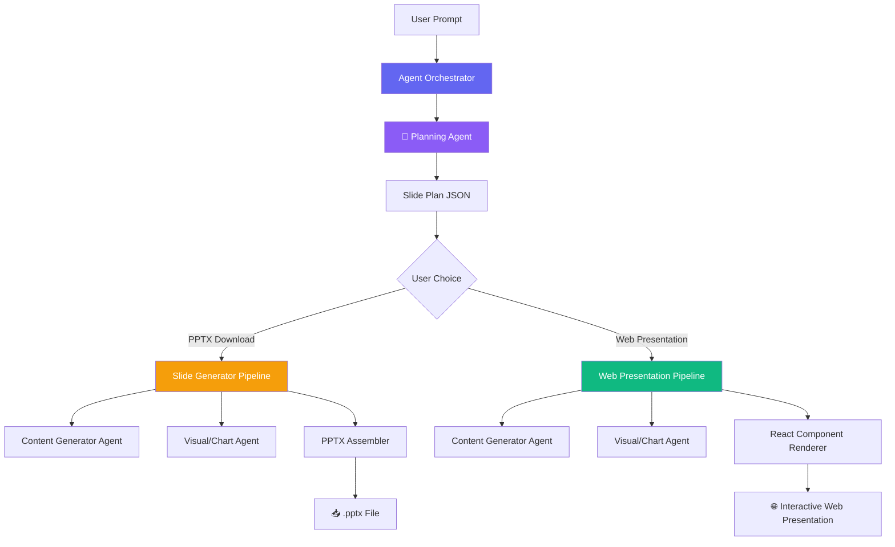

# 🎯 AI Presentation Maker Agent — Architecture Plan

## Language of Preference: **TypeScript (Next.js)**

Here's why TypeScript/Next.js is the best fit:

| Factor | Why TypeScript / Next.js |
|---|---|
| **Familiarity** | Existing experience with Next.js + Shadcn projects |
| **Two output modes** | Mode 1 (downloadable slides) and Mode 2 (web presentation) both live naturally in a web app |
| **AI Integration** | Google's `@google/genai` SDK has first-class TypeScript support |
| **Rich rendering** | Libraries like `reveal.js`, `slidev`, or custom React components for web presentations |
| **Charts/Infographics** | `recharts`, `chart.js`, `d3` all have excellent React bindings |
| **Export to PPTX** | `pptxgenjs` lets you generate real `.pptx` files server-side |
| **Shadcn UI** | Preferred component library — perfect for the builder UI |

---

## 🏗️ High-Level Architecture



---

## 🤖 Agent Flow (Multi-Step Agentic Pipeline)

The agent works in **phases**, each calling Gemini 2.5 Flash:

### Phase 1: **Planning Agent**
> Input: User's raw prompt (e.g., *"Make a presentation about Bangladesh history"*)

The Planning Agent generates a **structured slide plan** in JSON:
```json
{
  "title": "History of Bangladesh",
  "totalSlides": 12,
  "theme": "modern-dark",
  "slides": [
    {
      "slideNumber": 1,
      "type": "title",
      "title": "History of Bangladesh",
      "subtitle": "From Ancient Bengal to Modern Nation"
    },
    {
      "slideNumber": 2,
      "type": "content",
      "title": "Ancient Bengal (600 BCE - 1200 CE)",
      "bulletPoints": ["..."],
      "speakerNotes": "..."
    },
    {
      "slideNumber": 5,
      "type": "chart",
      "chartType": "timeline",
      "title": "Key Events Timeline",
      "data": {}
    },
    {
      "slideNumber": 8,
      "type": "infographic",
      "title": "Population Growth",
      "chartType": "bar",
      "data": {}
    }
  ]
}
```

**Key decisions made here:**
- Number of slides
- Slide types (`title`, `content`, `chart`, `image`, `comparison`, `quote`, `infographic`)
- What data needs charts/graphs
- Layout suggestions
- Color theme

### Phase 2: **Content Generation Agent**
For each slide, generates:
- Detailed bullet points / paragraphs
- Speaker notes
- Key statistics / data points
- Image search queries (for relevant images)

### Phase 3: **Visual / Chart Agent**
- Decides chart types (`bar`, `line`, `pie`, `timeline`, `map`)
- Generates structured chart data compatible with `recharts` / `chart.js`
- Picks color palettes that match the theme
- Generates infographic layouts

### Phase 4: **Assembly** (depends on user choice)

**Option A — PPTX Download:**
- Uses `pptxgenjs` to assemble a real PowerPoint file
- Embeds charts as images (rendered server-side with `canvas`)
- Applies professional templates/themes

**Option B — Web Presentation:**
- Renders as a full-screen, interactive React presentation
- Uses `reveal.js` or a custom slide framework
- Live charts with animations, hover effects, transitions
- Exportable to PDF via browser print

---

## 📁 Proposed Project Structure

```
slidemaker/
├── app/                          # Next.js App Router
│   ├── page.tsx                  # Landing / prompt input page
│   ├── create/
│   │   └── page.tsx              # Creation wizard (shows agent progress)
│   ├── presentation/
│   │   └── [id]/
│   │       └── page.tsx          # Web presentation viewer
│   ├── api/
│   │   ├── generate/
│   │   │   └── route.ts          # Main generation endpoint (streaming)
│   │   ├── export/
│   │   │   └── route.ts          # PPTX export endpoint
│   │   └── plan/
│   │       └── route.ts          # Planning-only endpoint
│   └── layout.tsx
│
├── lib/
│   ├── agents/                   # 🧠 Core Agent Logic
│   │   ├── orchestrator.ts       # Main agent orchestrator
│   │   ├── planner.ts            # Phase 1: Planning agent
│   │   ├── content-generator.ts  # Phase 2: Content generation
│   │   ├── visual-agent.ts       # Phase 3: Chart/visual decisions
│   │   └── prompts/              # System prompts for each agent
│   │       ├── planner.ts
│   │       ├── content.ts
│   │       └── visual.ts
│   │
│   ├── generators/               # 🔧 Output Generators
│   │   ├── pptx-generator.ts     # PowerPoint file generation
│   │   └── web-generator.ts      # Web presentation data assembly
│   │
│   ├── gemini.ts                 # Gemini API client setup
│   ├── schemas.ts                # Zod schemas for all data structures
│   └── types.ts                  # TypeScript types
│
├── components/
│   ├── ui/                       # Shadcn components
│   ├── prompt-input.tsx          # Main prompt input with suggestions
│   ├── generation-progress.tsx   # Real-time agent progress viewer
│   ├── plan-preview.tsx          # Show/edit the slide plan
│   ├── presentation/             # Web presentation components
│   │   ├── slide-renderer.tsx    # Main slide renderer
│   │   ├── slides/
│   │   │   ├── title-slide.tsx
│   │   │   ├── content-slide.tsx
│   │   │   ├── chart-slide.tsx
│   │   │   ├── comparison-slide.tsx
│   │   │   ├── quote-slide.tsx
│   │   │   └── infographic-slide.tsx
│   │   ├── charts/
│   │   │   ├── bar-chart.tsx
│   │   │   ├── line-chart.tsx
│   │   │   ├── pie-chart.tsx
│   │   │   └── timeline-chart.tsx
│   │   └── presentation-controls.tsx
│   └── theme-selector.tsx
│
├── styles/
│   └── presentation-themes/      # CSS themes for presentations
│       ├── modern-dark.css
│       ├── corporate.css
│       ├── minimal.css
│       └── vibrant.css
│
└── public/
    └── templates/                # PPTX template assets
```

---

## 🔑 Key Technical Decisions

### 1. Gemini Integration
```typescript
// lib/gemini.ts
import { GoogleGenAI } from "@google/genai";

const ai = new GoogleGenAI({ apiKey: process.env.GEMINI_API_KEY });

// Use structured output (JSON mode) for reliable parsing
export async function generateStructured<T>(
  prompt: string, 
  schema: ZodSchema<T>
): Promise<T> {
  const response = await ai.models.generateContent({
    model: "gemini-2.5-flash",
    contents: prompt,
    config: {
      responseMimeType: "application/json",
      responseSchema: zodToJsonSchema(schema),
    },
  });
  return schema.parse(JSON.parse(response.text));
}
```

### 2. Streaming Agent Progress
Use **Server-Sent Events (SSE)** to stream agent progress to the frontend:
```
Phase 1: Planning... ✅
Phase 2: Generating slide 1/12... 🔄
Phase 2: Generating slide 2/12... ⏳
...
```

### 3. Chart Strategy
- **Web mode**: Use `recharts` for interactive, animated charts
- **PPTX mode**: Render charts to canvas → export as PNG → embed in PPTX

### 4. Validation with Zod
Every agent output is validated with Zod schemas before passing to the next phase. This prevents cascading errors from malformed AI output.

---

## 🎨 Two Output Modes Compared

| Feature | PPTX Download | Web Presentation |
|---|---|---|
| **Charts** | Static PNG images | Interactive, animated |
| **Transitions** | PowerPoint native | CSS/JS animations |
| **Sharing** | Email the .pptx | Share a URL |
| **Editing** | Open in PowerPoint/Google Slides | Edit in app (future) |
| **Infographics** | Limited by PPTX | Full HTML/CSS/SVG |
| **Offline** | ✅ Yes | Needs hosting |
| **Complexity** | Medium | Higher (but more impressive) |

---

## 📊 Suggested MVP Scope

For the **v1 MVP**:

1. ✅ Prompt input → Planning Agent → Show plan to user
2. ✅ Content Generation for all slides
3. ✅ 3-4 chart types (bar, line, pie, timeline)
4. ✅ Web presentation mode with keyboard navigation
5. ✅ Basic PPTX export
6. ✅ 2-3 themes (dark, light, corporate)
7. ❌ ~~Image generation~~ (add later)
8. ❌ ~~Collaborative editing~~ (add later)
9. ❌ ~~User accounts / save history~~ (add later)

---

## 📦 Key Dependencies

| Package | Purpose |
|---|---|
| `next` | Framework |
| `@google/genai` | Gemini 2.5 Flash API |
| `zod` | Schema validation for AI outputs |
| `pptxgenjs` | PowerPoint generation |
| `recharts` | Interactive charts (web mode) |
| `reveal.js` | Web presentation framework (optional) |
| `shadcn/ui` | UI components |
| `framer-motion` | Slide transitions & animations |
